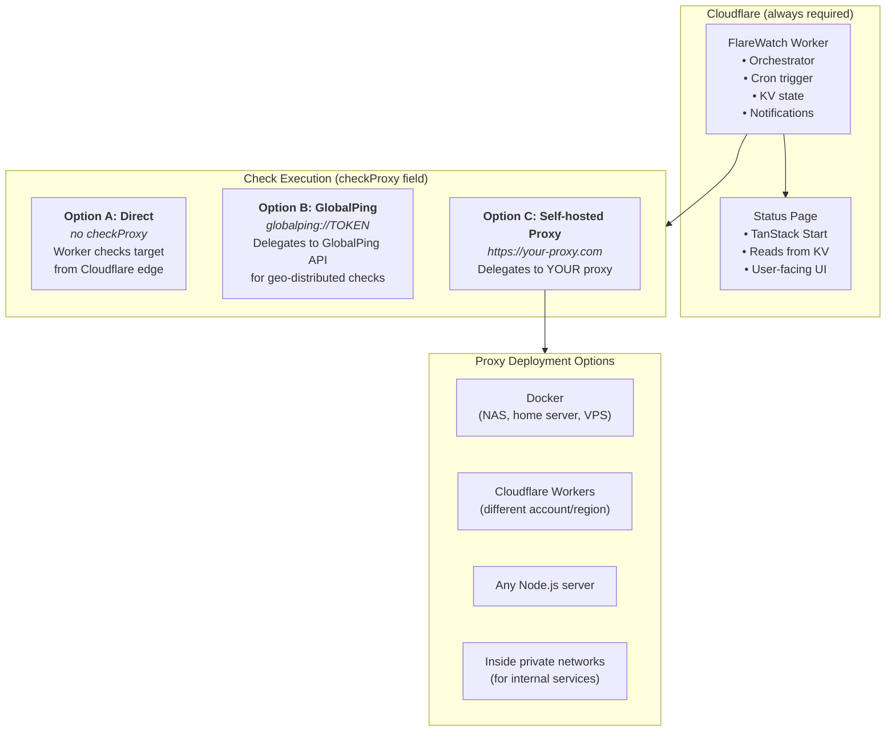

# FlareWatch Proxy

Self-hostable proxy for executing FlareWatch health checks from custom locations.

## Overview

The FlareWatch Proxy allows you to run monitoring checks from your own infrastructure instead of (or in addition to) Cloudflare's edge network. This is useful for:

- **Monitoring internal services** - Check services on private IPs (192.168.x.x, 10.x.x.x) that Cloudflare can't reach
- **Monitoring behind firewalls/VPNs** - Deploy the proxy inside your secured network
- **Geo-specific monitoring** - Deploy proxies in specific regions for location-based checks
- **Reducing Cloudflare Worker load** - Offload heavy checks to your own infrastructure
- **Cloudflare outage resilience** - Continue monitoring even if Cloudflare has issues

## Architecture



**Important**: The proxy is NOT a replacement for the main FlareWatch Worker. It only executes checks - the Worker still handles orchestration, state storage, and notifications.

## Quick Start

### Docker (Recommended for self-hosting)

The Docker image is production-optimized:

- Runs as a non-root user
- Ships a single bundled JS file (no `node_modules`)
- Removes package managers (npm/yarn/corepack) to reduce attack surface

```bash
# From the repository root
# Optional: configure the proxy (token/location/port)
cp services/proxy/docker/.env.example services/proxy/docker/.env

docker compose -f services/proxy/docker/docker-compose.yml up -d

# Check it's running
curl http://localhost:3000/health
```

### Docker with custom configuration

```bash
docker run -d \
  -p 3000:3000 \
  -e FLAREWATCH_PROXY_LOCATION="NYC" \
  -e FLAREWATCH_PROXY_TOKEN="<proxy-token>" \
  flarewatch-proxy
```

Use any host port you want (example: `-p 8080:3000`). If you want the proxy to listen on a different
container port too, set `PORT` (example: `-e PORT=8080 -p 8080:8080`).

### Node.js

```bash
# Install dependencies
pnpm install

# Development (with hot reload)
pnpm proxy:dev

# Production
pnpm -F @flarewatch/proxy build
pnpm proxy:start
```

### Cloudflare Workers

```bash
cd services/proxy

# Configure (optional - set auth token)
wrangler secret put FLAREWATCH_PROXY_TOKEN

# Deploy
pnpm deploy
```

## Configuration

### Environment Variables

| Variable                    | Description                                                | Default     |
| --------------------------- | ---------------------------------------------------------- | ----------- |
| `PORT`                      | Server port                                                | `3000`      |
| `FLAREWATCH_PROXY_TOKEN`    | Bearer token for authentication (optional but recommended) | -           |
| `FLAREWATCH_PROXY_LOCATION` | Override auto-detected location (e.g., "NYC", "London")    | Auto-detect |

### Monitor Configuration

Configure monitors to use your proxy in `packages/config/src/worker.ts`:

```typescript
export const workerConfig: WorkerConfig = {
  monitors: [
    // Direct check from Cloudflare edge
    {
      id: 'public-api',
      name: 'Public API',
      method: 'GET',
      target: 'https://api.example.com/health',
    },

    // Check via self-hosted proxy (internal service)
    {
      id: 'internal-db',
      name: 'Internal Database',
      method: 'TCP_PING',
      target: '192.168.1.50:5432',
      checkProxy: 'http://192.168.1.100:3000/check',
    },

    // Check via proxy in Singapore
    {
      id: 'apac-api',
      name: 'APAC API',
      method: 'GET',
      target: 'https://api.example.com/health',
      checkProxy: 'https://sgp-proxy.myserver.com/check',
    },

    // Target request with authentication (sent by the proxy to the target)
    {
      id: 'secured-service',
      name: 'Secured Service',
      method: 'GET',
      target: 'https://internal.example.com',
      checkProxy: 'https://my-proxy.example.com/check',
      headers: {
        Authorization: 'Bearer <target-token>',
      },
    },
  ],
};
```

## API Endpoints

| Endpoint  | Method | Description                       |
| --------- | ------ | --------------------------------- |
| `/`       | GET    | Info page                         |
| `/health` | GET    | Health check (for load balancers) |
| `/check`  | POST   | Execute a monitor check           |

### POST /check

Execute a monitor check.

**Request Body** (JSON):

```json
{
  "id": "my-service",
  "name": "My Service",
  "method": "GET",
  "target": "https://api.example.com/health",
  "timeout": 5000,
  "expectedCodes": [200],
  "responseKeyword": "ok",
  "sslCheckEnabled": true
}
```

**Response** (JSON):

```json
{
  "location": "NYC",
  "result": {
    "ok": true,
    "latency": 145,
    "ssl": {
      "expiryDate": 1735689600,
      "daysUntilExpiry": 89,
      "issuer": "Let's Encrypt",
      "subject": "api.example.com"
    }
  }
}
```

## Platform Feature Matrix

| Feature                    | Node.js / Docker | Cloudflare Workers |
| -------------------------- | ---------------- | ------------------ |
| HTTP/HTTPS checks          | ✅               | ✅                 |
| TCP_PING checks            | ✅               | ❌                 |
| SSL certificate monitoring | ✅               | ❌                 |
| Location auto-detection    | ✅ (IP API)      | ✅ (CF Trace)      |

**Note**: TCP and SSL features require Node.js runtime. If you need these features, use Docker or a Node.js server instead of Cloudflare Workers.

## Security Considerations

### Authentication

This proxy can (and should) require a Bearer token to prevent unauthorized check execution.

Generate a token:

```bash
openssl rand -base64 32
```

Set the token on the proxy:

```bash
# Docker
docker run -e FLAREWATCH_PROXY_TOKEN="<proxy-token>" ...

# Cloudflare Workers (proxy deployment)
cd services/proxy
wrangler secret put FLAREWATCH_PROXY_TOKEN
```

Then set the same token on the main FlareWatch Worker so it can authenticate to the proxy:

```bash
# If you deploy the worker via Pulumi (recommended)
pulumi -C infra config set --secret proxyToken

# If you deploy the worker manually with Wrangler
cd services/worker
wrangler secret put FLAREWATCH_PROXY_TOKEN
```

The worker sends `Authorization: Bearer <token>` automatically for proxied checks when
`FLAREWATCH_PROXY_TOKEN` is set.

Do not put the proxy token in `monitor.headers` — those headers are forwarded by the proxy to the
monitored target.

```typescript
{
  checkProxy: 'https://my-proxy.example.com/check',
}
```

### Network Isolation

- Deploy the proxy in the same network as the services it monitors
- Use a private network or VPN for internal services
- Consider using Cloudflare Tunnel for secure access without public exposure

### HTTPS

For production deployments:

- Use a reverse proxy (nginx, Caddy) with TLS termination
- Or deploy behind Cloudflare Tunnel
- The `checkProxy` URL should use HTTPS in production

## Use Cases

| Scenario                                | Configuration                       |
| --------------------------------------- | ----------------------------------- |
| Monitor internal services (192.168.x.x) | Deploy proxy inside your network    |
| Monitor services behind firewall/VPN    | Deploy proxy inside secured network |
| Geo-specific monitoring                 | Deploy proxy in target region       |
| Reduce Cloudflare Worker CPU time       | Offload checks to self-hosted proxy |
| Monitor from home network               | Run proxy on NAS or Raspberry Pi    |

## Development

```bash
# Start development server with hot reload
pnpm proxy:dev

# Build for production (compiles TypeScript)
pnpm -F @flarewatch/proxy build

# Type check
pnpm -F @flarewatch/proxy compile

# Build Docker image (from repo root)
docker build -t flarewatch-proxy -f services/proxy/docker/Dockerfile .

# Deploy to Cloudflare Workers
pnpm proxy:deploy
```

## Troubleshooting

### "TCP checks require Node.js runtime"

TCP_PING checks only work on Node.js/Docker, not on Cloudflare Workers. Use a Docker deployment for TCP monitoring.

### "SSL checks require Node.js runtime"

Same as above - SSL certificate monitoring requires Node.js. Deploy with Docker for full functionality.

### Connection refused

- Check that the proxy is running: `curl http://localhost:3000/health`
- Verify the target service is accessible from the proxy's network
- Check firewall rules

### Authentication failed

- Verify `FLAREWATCH_PROXY_TOKEN` is set on the proxy and matches the Worker secret
- If calling the proxy manually (curl/Postman), send `Authorization: Bearer <token>`
